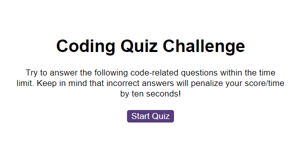

# Description

This repository features a coding quiz which makes use of DOM manipulation, event listeners, setInterval and conditionals to progress through the questions. Scores are then stored in localStorage.

## Installation

N/A

## Usage

Click the buttons matching the right answers to progress through the questions. Every incorrect answer subtracts 10 seconds from the timer and your final score!

## Credits

How to play audio using JS https://stackoverflow.com/questions/9419263/how-to-play-audio - *line 16-17 in logic.js*

Create cleaner code with event delegation https://blog.bitsrc.io/cleaner-code-with-event-delegation-in-javascript-bb6dd27be64d - *lines 70 - 80 in logic.js*

Extract button text content on click https://stackoverflow.com/questions/73593129/js-extract-button-text-content-on-click - *lines 70 -75 in logic.js*

Add event listener to multiple elements https://byby.dev/js-add-event-listener - *lines 102 - 104 in logic.js*

Remove Child method https://www.w3schools.com/jsref/tryit.asp?filename=tryjsref_node_removechild_while - *lines 47 - 50 in logic.js*

Event listener DOMContentLoaded method https://stackoverflow.com/questions/26107125/cannot-read-property-addeventlistener-of-null - *lines 11 - 14 and 33 - 36 in scores.js*

## License

Mit License

## GitHub Pages link

https://zerofloat.github.io/code-quiz/
